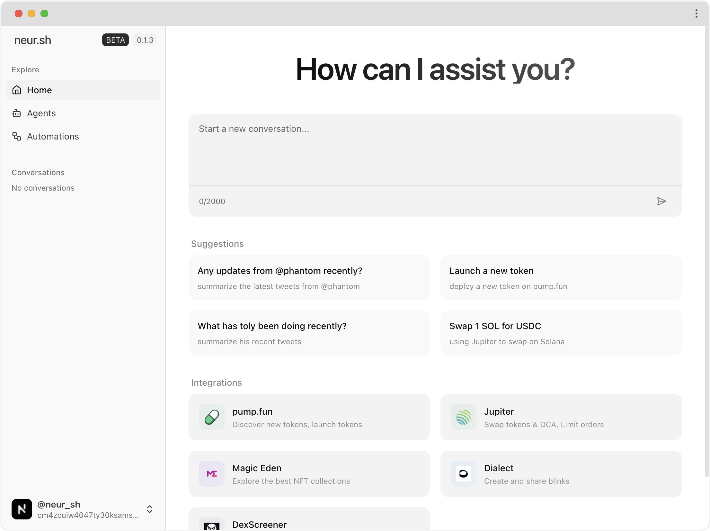

# Neur

> The Intelligent Copilot for Solana

Neur is an **open-source**, full-stack application that brings together the power of LLM models and blockchain technology. Designed for the [Solana](https://solana.com/) ecosystem, Neur enables seamless interactions with DeFi protocols, NFTs, and much more.

## Features

- **Modern UI**: Beautiful, responsive design with Tailwind CSS, Mobile-friendly, Dark Mode
- **Intelligent Agent**: Natural language understanding tailored for DeFi, NFTs, and Solana-native interactions
- **Smart Tools**: Execute complex blockchain operations using our advanced function-calling system
- **Embedded Wallet**: Integrated wallet management with real-time portfolio insights
- **DeFi Integration**: Access to swaps, staking, and cross-platform functionalities
- **NFT Suite**: Comprehensive NFT collection management and analysis
- **Live Analytics**: Real-time market trends and portfolio performance tracking
- **Ecosystem Access**: Direct integration with Jupiter, Magic Eden, and other Solana services

## Roadmap

We aim to build the **most advanced interface** for the Solana Network, enabling users to design AI agents for **autonomous actions and custom strategies**. These agents merge live blockchain data with real-time internet insights, offering an integrated solution for managing the crypto ecosystem.

Our current focus is developing **core infrastructure and agent functionality**.

### Core Infrastructure

- [x] Landing Page
- [x] User Model
- [x] Chat Interface
- [x] Chat Persistence
- [x] Streaming Tool Components
- [x] Embedded Wallet
  - [ ] Migrate to Phantom Embedded Wallet

### Agent Capabilities

- [x] Multi-Tool Usage
- [ ] Multimodal
  - [x] Image
  - [ ] Realtime Voice Conversation
- [ ] Memory Layer
- [ ] Web2 Integration
  - [x] Web Scraping
  - [ ] Twitter Search

### Solana Integration

- [x] SNS (Solana Name Service) Resolver
- [x] Wallet Portfolio
- [ ] Transaction Parser
- [x] NFT Operations
- [x] Basic Token Operations
  - [x] Send/Swap Tokens
  - [x] Token Launch (pump.fun)
- [x] DeFi Integration
  - [x] Jupiter
    - [x] Swaps
    - [x] Price API v2
    - [x] Verified Token Search
    - [ ] Limit Orders
    - [ ] DCA
  - [x] Pump.Fun Integration
    - [x] Deploy Token
  - [x] Dexscreener Integration
    - [x] Token Profile
    - [x] Paid Orders Check
  - [ ] Blinks Integration
  - [x] Magic Eden Integration

### Market Intelligence

- [x] Token Trends (via Defined.fi)
- [x] NFT Trends (via Magic Eden)

### Automation

- [ ] Automated On-Chain Actions
- [ ] Personalized Agent
- [ ] Trading AI

## Contributing

We welcome contributions from the community! Please see our [CONTRIBUTING.md](CONTRIBUTING.md) for more information.

## Development

Information about setting up a local development environment can be found in [LOCAL_DEV.md](LOCAL_DEV.md).
